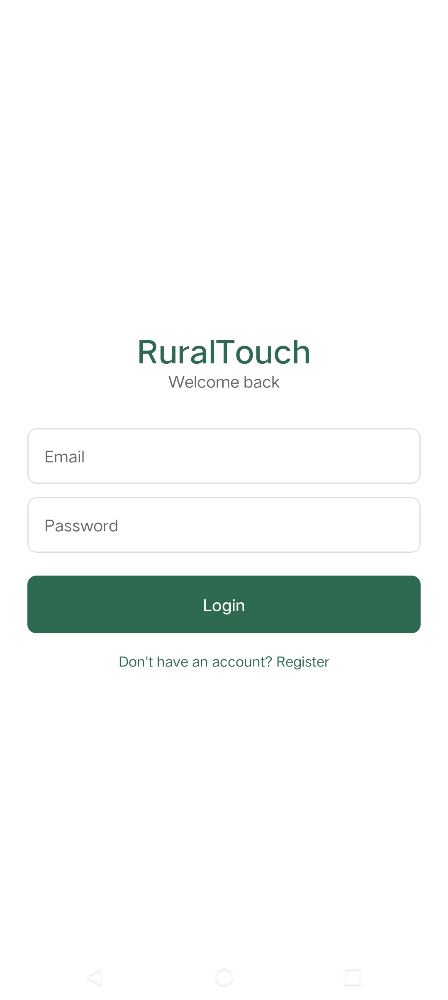
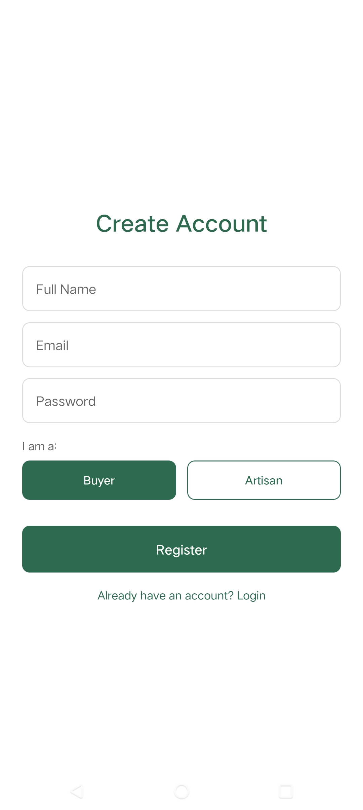
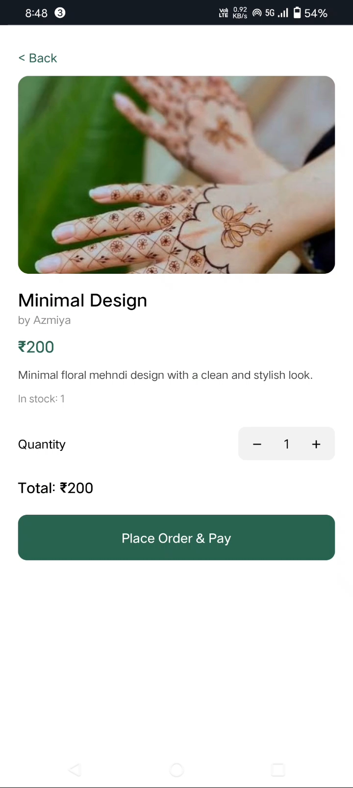
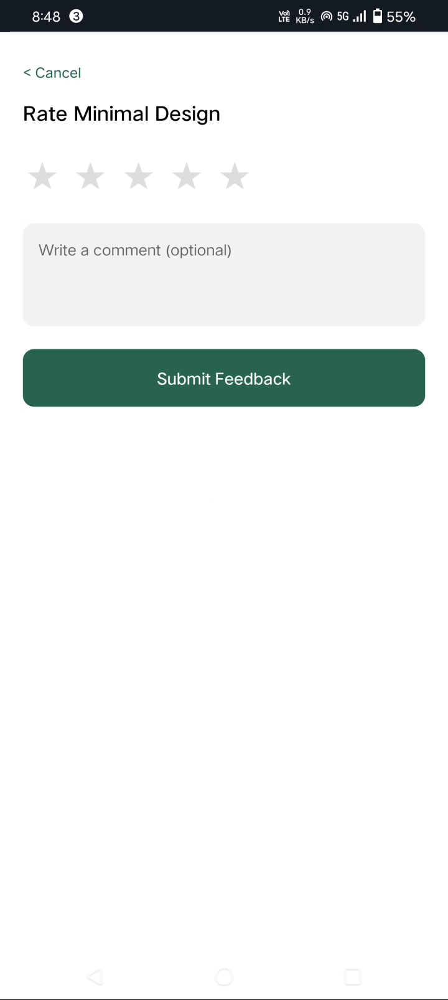
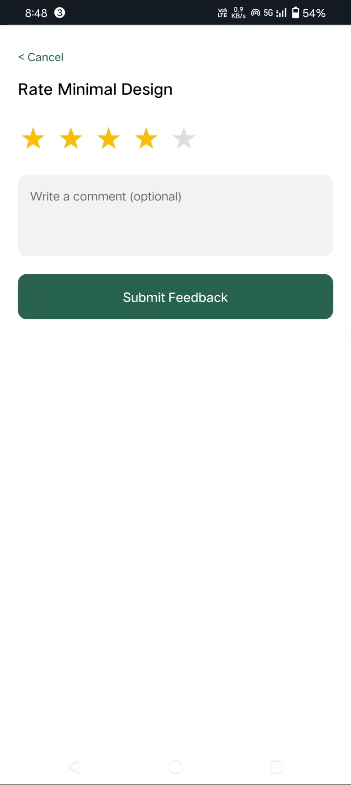
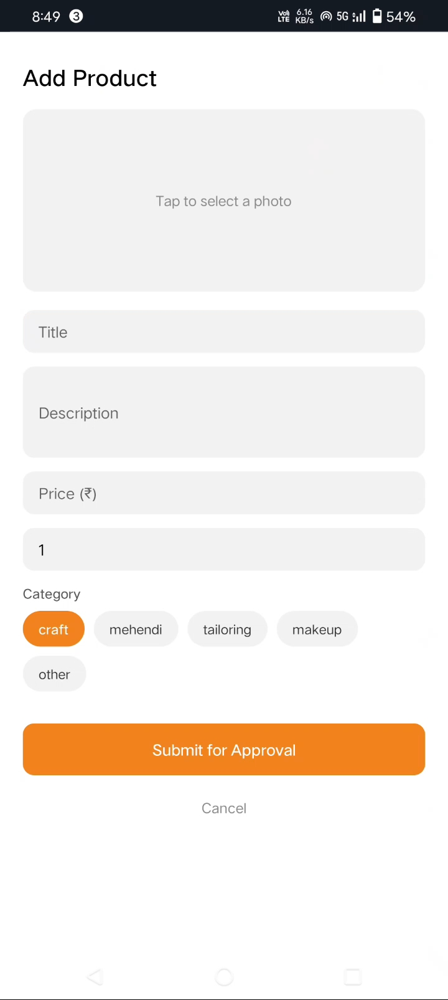
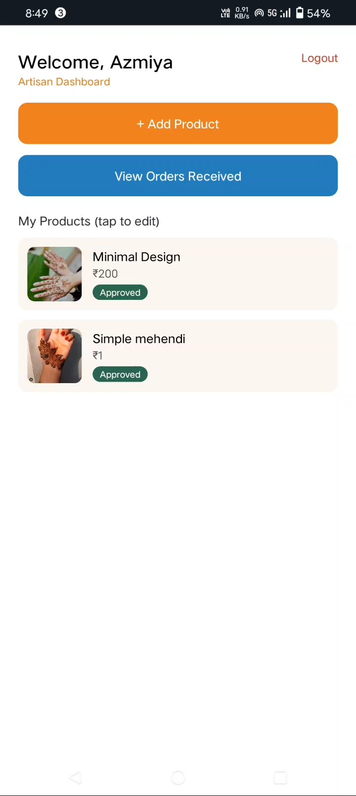
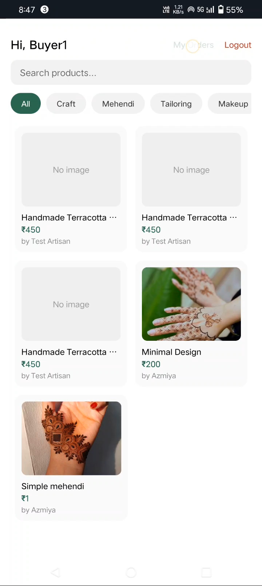

# RuralTouch 🧵

**Connecting rural artisans with buyers — a full-stack mobile marketplace.**

RuralTouch is a role-based e-commerce platform built for craftmakers, mehendi artists, tailors, and makeup artists to list and sell their work directly to buyers, with an admin approval layer to keep quality high. Built end-to-end as a portfolio project: React Native mobile app, Node/Express API, MongoDB Atlas, Cloudinary image hosting, and Razorpay test-mode payments.

---

## ✨ Features

- **Three user roles** — Buyer, Artisan, Admin — each with a dedicated dashboard
- **JWT authentication** with bcrypt password hashing
- **Product listings** with an admin approval workflow (pending → approved/rejected)
- **Image uploads** via Cloudinary, streamed straight from the phone camera roll
- **Search & category filtering** for browsing products
- **Order placement + tracking**, with a full status lifecycle (placed → shipped → delivered)
- **Razorpay payment integration** (test mode) using a WebView checkout, with server-side signature verification
- **Feedback & star ratings** on delivered orders
- **Artisan tools** — add, edit, delete products; view and update incoming orders
- **Admin tools** — approve/reject listings, view all registered users

---

## 🛠 Tech Stack

| Layer | Technology |
|---|---|
| Mobile app | React Native (Expo SDK 54), Expo Router |
| Backend | Node.js, Express |
| Database | MongoDB Atlas (Mongoose) |
| Image storage | Cloudinary |
| Payments | Razorpay (test mode) |
| Auth | JWT + bcrypt |

---

## 📱 Screenshots

| Login | Register |
|---|---|
|  |  |

| Buyer — Browse Products | Product Detail |
|---|---|
|  |  |

| My Orders | Feedback & Rating |
|---|---|
|  |  |

| Artisan Dashboard | Add Product |
|---|---|
|  |  |

---

## 🏗 Architecture

```
ruraltouch/
├── backend/
│   ├── models/          # User, Product, Order, Feedback (Mongoose schemas)
│   ├── routes/          # auth, products, orders, feedback, users
│   ├── middleware/       # JWT auth guard, role-based authorize(), Cloudinary upload
│   └── server.js
└── mobile/
    └── src/
        ├── app/          # Expo Router entry (_layout.tsx, index.tsx)
        ├── screens/      # Role dashboards + feature screens
        ├── context/      # AuthContext (JWT + user state)
        └── api/          # Axios instance with token interceptor
```

**Role-based routing:** a single `switch` on `user.role` in `index.tsx` renders the correct dashboard — Buyer, Artisan, or Admin — after login. Each dashboard composes its own sub-screens (Add Product, My Orders, Profile, etc.) via local state rather than a nested navigator, keeping the app lightweight.

**Security model:** admin accounts are **provisioned, not self-registered** — there's no "Admin" option at signup. This follows the principle of least privilege: only an existing admin (via direct database access in this project's scope) can grant admin rights, preventing privilege escalation through the public registration form.

---

## 🚀 Getting Started

### Backend
```bash
cd backend
npm install
```
Create a `.env` file:
```
MONGO_URI=your_mongodb_atlas_connection_string
JWT_SECRET=your_jwt_secret
CLOUDINARY_CLOUD_NAME=your_cloud_name
CLOUDINARY_API_KEY=your_api_key
CLOUDINARY_API_SECRET=your_api_secret
RAZORPAY_KEY_ID=your_razorpay_test_key_id
RAZORPAY_KEY_SECRET=your_razorpay_test_key_secret
```
```bash
npx nodemon server.js
```

### Mobile app
```bash
cd mobile
npm install
npx expo start
```
Update the API base URL in `src/api/api.js` to point at your backend's address.

Scan the QR code with **Expo Go** (Android/iOS) to run the app on your device.

---

## 🔑 Test Accounts

Since admin signup is intentionally disabled, seed an admin manually:
1. Register a normal account through the app
2. In MongoDB Atlas, open the `users` collection and change that document's `role` field to `"admin"`

---

## 📌 Roadmap / Possible Extensions

- Standalone APK build (EAS Build) for install-without-Expo-Go demos
- Push notifications on order status changes
- In-app chat between buyer and artisan
- Analytics dashboard for artisans (sales over time)

---

## 👤 Author

Built by **Azmiya** as a full-stack portfolio project.
